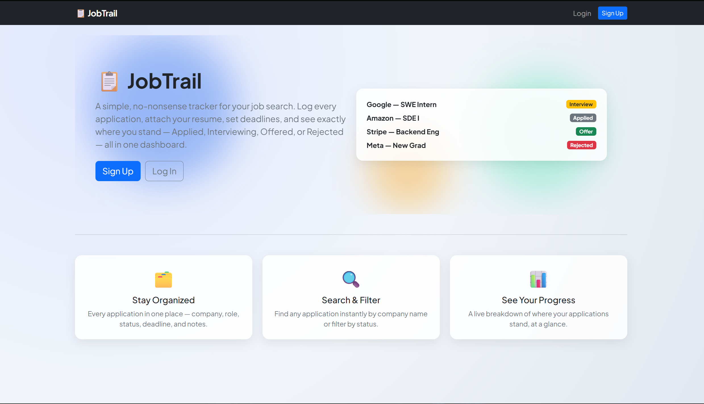
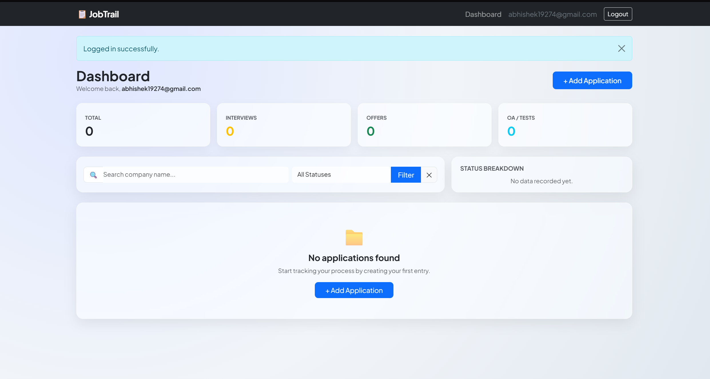
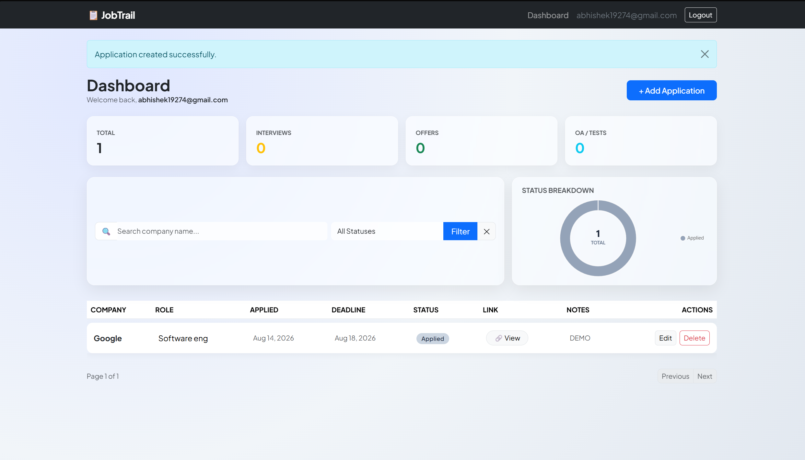

<div align="center">

# 📋 Job Application Tracker

**A full-stack Flask web app to track, organize, and analyze your job search — built from scratch.**

[](https://www.python.org/)
[](https://flask.palletsprojects.com/)
[](https://www.sqlalchemy.org/)
[](https://render.com/)

**[🔗 Live Demo](https://job-application-tracker-i2h1.onrender.com)** &nbsp;·&nbsp; **[🐛 Report a Bug](../../issues)**

</div>

---

## 📖 About

Job hunting means juggling dozens of applications across companies, statuses, and deadlines — and a spreadsheet only gets you so far. This project replaces that spreadsheet with a real, private, per-user web application: register an account, log every application you send out, track it through the pipeline (Applied → OA/Test → Interview → Offer/Rejected), and see the whole thing summarized at a glance on a dashboard.

Built entirely from scratch — no starter template — as a way to go deeper than tutorial-following: real authentication, real per-user data isolation, real deployment, real bugs caught and fixed along the way.

> ⚠️ **Note on the live demo:** This is hosted on Render's free tier, which has two quirks worth knowing before you try it:
> - The app may take **30–60 seconds** to wake up if it's been idle — please give it a moment on first load.
> - The database currently resets on every redeploy (free-tier ephemeral storage). A migration to a persistent Postgres database is on the roadmap below.

---

## ✨ Features

- 🔐 **Authentication** — secure registration and login with hashed passwords (Werkzeug), session management via Flask-Login
- 📝 **Full CRUD** — add, view, edit, and delete job applications, all scoped strictly to the logged-in user
- 🔒 **Ownership enforcement** — every edit/delete route verifies the record actually belongs to the requesting user (returns `403 Forbidden` otherwise)
- 🔎 **Search & filter** — filter the dashboard by company name and application status, combinable and URL-shareable
- 📊 **Analytics dashboard** — live stat cards (total, interviews, offers, OA/tests) and a Chart.js doughnut chart breaking down applications by status
- 📄 **Pagination** — dashboard results paginate cleanly once the list grows
- 📎 **File uploads** — attach a resume/cover letter per application
- ⏰ **Stale application alerts** — applications untouched for 2+ weeks are visually flagged
- 📧 **Email summaries** — Flask-Mail integration to email a summary of stale applications
- 🔌 **JSON API** — `/api/applications` endpoint returning the logged-in user's data, laying groundwork for a future frontend
- 🎨 **Custom error pages** — handled `403`, `404`, and `500` pages instead of default stack traces
- 🤖 **Zero-downtime keep-alive** — a GitHub Actions workflow pings the deployed app every 12 minutes to prevent free-tier idle sleep

---

## 🛠️ Tech Stack

| Layer | Technology |
|---|---|
| **Backend** | Flask |
| **Database / ORM** | Flask-SQLAlchemy (SQLAlchemy 2.0 typed models) |
| **Auth** | Flask-Login, Werkzeug password hashing |
| **Forms** | Flask-WTF, WTForms |
| **Email** | Flask-Mail |
| **Frontend** | Jinja2, Bootstrap 5, Chart.js |
| **Deployment** | Render (Gunicorn WSGI server) |
| **CI / Uptime** | GitHub Actions (scheduled keep-alive workflow) |

---

## 📸 Screenshots

**Landing page**


**Dashboard — empty state**


**Dashboard — with data, search/filter, and status breakdown chart**


---

## 🚀 Getting Started Locally

### Prerequisites
- Python 3.10+
- pip

### Installation

```bash
# Clone the repo
git clone https://github.com/yourusername/job-application-tracker.git
cd job-application-tracker

# Create and activate a virtual environment
python -m venv .venv
.venv\Scripts\activate      # Windows
source .venv/bin/activate   # macOS/Linux

# Install dependencies
pip install -r requirements.txt
```

### Environment variables

Create a `.env` file in the project root:

```env
SECRET_KEY=your-secret-key-here
MAIL_USERNAME=your-email@gmail.com
MAIL_PASSWORD=your-gmail-app-password
```

Generate a secret key quickly:
```bash
python -c "import secrets; print(secrets.token_hex(16))"
```

### Run it

```bash
python app.py
```

Visit `http://127.0.0.1:8000` in your browser.

---

## 🗂️ Project Structure

```
job-application-tracker/
├── .github/workflows/
│   └── keep-alive.yml      # Scheduled uptime ping
├── static/
│   └── css/styles.css
├── templates/
│   ├── base.html
│   ├── home.html
│   ├── register.html
│   ├── login.html
│   ├── dashboard.html
│   └── add_edit.html
├── app.py                  # Routes and app config
├── models.py                # SQLAlchemy models (User, JobApplication)
├── forms.py                 # Flask-WTF forms
├── requirements.txt
├── Procfile                 # Gunicorn start command for deployment
└── README.md
```

---

## 🔌 API Reference

| Method | Endpoint | Description | Auth required |
|---|---|---|---|
| `GET` | `/api/applications` | Returns the logged-in user's applications as JSON | ✅ |

---

## 🗺️ Roadmap

- [ ] Migrate from SQLite to a persistent PostgreSQL database
- [ ] CSV export of applications
- [ ] Dark mode
- [ ] Token-based auth for the API layer (mobile/external client support)
- [ ] Automated tests (pytest)

---

## 👤 Author

**Abhishek Patil**

- GitHub: [@abhishek19274-cyber](https://github.com/abhishek19274-cyber)
- LinkedIn: *add your link here*

---

<div align="center">

If you found this project interesting, consider giving it a ⭐ — it helps a lot!

</div>
